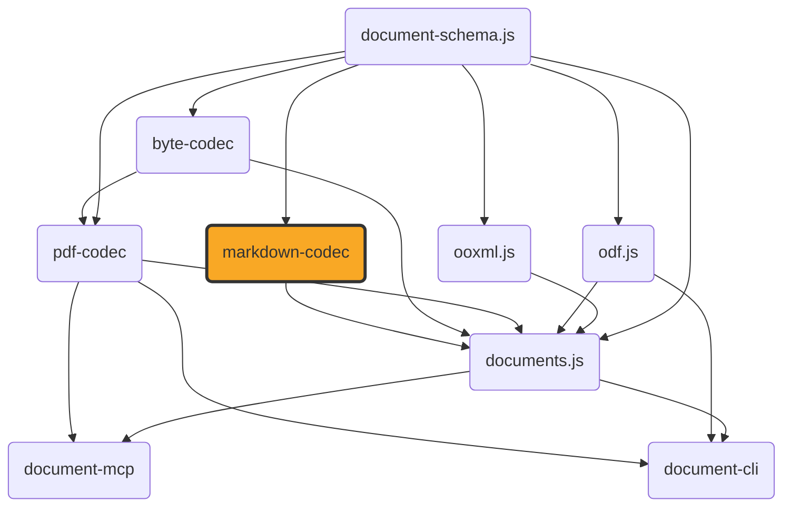

# markdown-codec

[](https://github.com/ExaDev/markdown-codec) [](https://www.npmjs.com/package/markdown-codec) [](https://github.com/ExaDev/markdown-codec/releases/latest) [](https://github.com/ExaDev/markdown-codec/actions)

> Hand-written CommonMark+GFM ⇄ `DocumentPackage` codec, built on [document-schema.js](https://github.com/ExaDev/document-schema.js).

The same "hand-write the format instead of wrapping a third-party library" bet as [`pdf-codec`](https://github.com/ExaDev/pdf-codec), aimed at CommonMark and GFM. No `micromark`/`remark`/`marked`/`markdown-it`/`commonmark`/`mdast`/`unified`/`turndown`/`showdown` dependency (enforced by eslint `no-restricted-imports`). Runtime dependencies: `document-schema.js` (the shared pivot) and `zod`. `readMarkdown`/`writeMarkdown` read and write that pivot's tree-form `DocumentPackage`; `readMarkdownContent`/`writeMarkdownContent` read and write the flat `ContentDocument` underneath it — the same model [`documents.js`](https://github.com/ExaDev/documents.js) builds docx/pptx/odt/odp conversions around. See [Two encodings](#two-encodings-documentpackage-and-contentdocument).



## Status

The scanner, block parser, and inline parser are complete hand-written implementations of CommonMark 0.31.2's two-phase algorithm plus GFM's table/strikethrough/autolink/task-list-item extensions and GitHub's footnotes (see [Footnotes](#footnotes)). Both encodings' read/write pairs and both `z.codec()` pairs are wired and real. Conformance suites measure the full public surface (`readMarkdownContent` → `writeMarkdownContent` → reparse → render to HTML) against the vendored CommonMark/GFM corpora — see [Fidelity](#fidelity) for why the rate is below 100% (dominated by what `ContentDocument` can represent, not parsing gaps).

## Getting started

Requires Node.js `>=20` and pnpm `11.6.0` (pinned via `packageManager` in `package.json`).

```sh
pnpm install
```

Install as a dependency in another project:

```sh
pnpm add markdown-codec
# or
npm install markdown-codec
```

Published to [npmjs.org](https://www.npmjs.com/package/markdown-codec) via OIDC trusted publishing. `dist/` is committed rather than gitignored — a holdover from a pre-publish period when a git-tarball install needed a working build; now a known cleanup.

## Usage

Reading and writing markdown text:

```ts
import { readMarkdown, writeMarkdown } from 'markdown-codec';

const { documentPackage, diagnostics } = readMarkdown('# Title\n\nSome **bold** text with a [link](https://example.com).', {
  frontMatter: true, // parse a leading YAML front matter block into the package's metadata
  footnotes: true, // recognise [^label] markers and [^label]: definitions (default; see Footnotes)
  images: (destination) => undefined, // a synchronous MarkdownImageResolver port for non-data: URI images
});

const markdown = writeMarkdown(documentPackage, {
  bulletListMarker: '-',
  emphasisMarker: '_',
  frontMatter: true, // emit the package's metadata back out as a leading front matter block
});
```

`documentPackage` is a `DocumentPackage` — document-schema.js's tree form, with a minted styles table (see [Two encodings](#two-encodings-documentpackage-and-contentdocument)). The field is named `documentPackage` rather than `package` because `package` is a reserved word in strict mode, so `const { package } = readMarkdown(src)` would not parse.

Both accept an optional `signal` (`AbortSignal`) and `sink` (`MarkdownDiagnosticSink`, called once per recoverable issue or construct-mapping gap — see [Gotchas](#gotchas-and-quirks)). `writeMarkdown` throws `MarkdownUnsupportedDocumentKindError` for a package whose `kind` is not `'wordprocessing'`, checked before flattening so every non-`'wordprocessing'` package reaches it the same way regardless of what else about that package would have failed document-schema.js's own `flattenPackage`. A `'wordprocessing'` package can still fail to flatten — a group carrying a style reference the package's own `styles` table has no entry for — and that failure surfaces as `MarkdownPackageFlattenError`, not a bare `Error` from the dependency. A `DocumentPackage`'s own `definitions`/`layers`/`attachments`/`destinations`/`pages` tables have no flat-`ContentDocument` home to land in; `writeMarkdown` reports one `PACKAGE_TABLE_DROPPED` diagnostic per non-empty table it finds rather than dropping them without a trace.

The same round trip as a schema-validated [`z.codec()`](https://zod.dev) pair, mirroring `pdf-codec`'s `pdfCodec`:

```ts
import { z } from 'zod';
import { markdownCodec, MarkdownBytesSchema } from 'markdown-codec';

const documentPackage = z.decode(markdownCodec, bytes); // throws if bytes are not well-formed UTF-8
const bytes2 = z.encode(markdownCodec, documentPackage);
```

`MarkdownBytesSchema` checks for well-formed UTF-8. The no-options form only; `readMarkdown`/`writeMarkdown` remain the entry points for an `AbortSignal` or diagnostic sink. Every construct-mapping gap reports through the sink as a stable code (e.g. `md/nested-emphasis-flattened`) — see `MarkdownDiagnosticCodes` and [Gotchas](#gotchas-and-quirks).

## Two encodings: `DocumentPackage` and `ContentDocument`

document-schema.js states one document in two shapes, and owns the transform between them: the flat `ContentDocument` every codec's lowering pipeline actually builds, and the tree-form `DocumentPackage` a serialised artefact carries — sections, headings, lists, and construct boundaries as real nested groups, plus a styles table minted over repeated property tuples. `assemblePackage` goes flat → tree (`decompose` then `factorStyles`), `flattenPackage` goes tree → flat. Only one direction is a genuine round trip: `flattenPackage(assemblePackage(document))` reproduces `document` exactly, for any `ContentDocument` this package's own read side produces (checked against the full CommonMark and GFM conformance corpora, not just a hand-picked fixture — see `src/conformance.test.ts`/`src/gfm-conformance.test.ts`'s own "tree pair matches the flat pair" suite). `assemblePackage(flattenPackage(documentPackage))` does not, in general, reproduce `documentPackage` — a package carrying `definitions`/`layers`/`attachments`/`destinations`/`pages` loses all of them on the way through `flattenPackage`, which carries forward only `metadata` and `symbolTable` (see [Gotchas](#gotchas-and-quirks)).

This package exposes a read/write pair and a codec at each level. The unsuffixed names are the tree-form ones and are what to reach for by default — a codec is a construction site, so the tree is what a caller gets unless they ask for otherwise. The `Content`-suffixed names are the flat pair one level down, mirroring the `readXlsx`/`readXlsxContent` naming already in [`ooxml.js`](https://github.com/ExaDev/ooxml.js):

| Level | Read | Write | Codec | Value type |
| --- | --- | --- | --- | --- |
| Tree (default) | `readMarkdown` | `writeMarkdown` | `markdownCodec` | `DocumentPackage` |
| Flat | `readMarkdownContent` | `writeMarkdownContent` | `markdownContentCodec` | `ContentDocument` |

The tree pair is exactly the flat pair with the transform composed on — `readMarkdown` is `assemblePackage` over `readMarkdownContent`, `writeMarkdown` is `flattenPackage` before `writeMarkdownContent` — so both render identical markdown from the same source, pinned in `src/package.test.ts`. Options, diagnostics, and error behaviour are identical at both levels.

Reach for the flat pair when composing a package boundary by hand (`decompose`/`flattenPackage` directly, or `factorStyles` with your own minting policy), when feeding a `ContentDocument`-consuming builder such as `documents.js`'s conversion pipeline, or when a layout stage needs to stamp frames onto content before it is decomposed. Everything else wants the tree.

```ts
import { readMarkdownContent, writeMarkdownContent } from 'markdown-codec';

const { document } = readMarkdownContent(source); // a ContentDocument: kind, metadata, sections
const markdown = writeMarkdownContent(document);
```

## Architecture

Modelled on `pdf-codec`'s own layering, aimed at CommonMark+GFM instead of PDF:

- **`src/diagnostics/`** — three-tier diagnostic policy (throw/recover/degrade); `MarkdownDiagnosticCodes` names every code.
- **`src/ast/`** — markdown AST node types (document/block/inline union), Zod-first.
- **`src/options/`** / **`src/defaults/`** — read/write options (GFM toggles, sink, `AbortSignal`, write-side style) and defaults.
- **`src/scan/`** — CommonMark line/character scanner, plus `entity-table.ts` (generated from `assets/html-entities/entities.json`).
- **`src/block/`** — CommonMark block-structure algorithm (open-block stack, continuation matching): paragraphs, headings, code blocks, block quotes, lists (incl. GFM task-list-item), thematic breaks, link references, footnote definitions, GFM tables.
- **`src/inline/`** — emphasis, code spans, links, autolinks, raw HTML, GFM strikethrough, footnote references, line breaks. `link.ts` and `footnote.ts` hold the label grammars the block phase shares.
- **`src/html/`** — raw HTML recognition (bounded rules, not a general parser) plus `render.ts` (conformance oracle; internal only).
- **`src/image/`** — PNG/JPEG dimension reader and base64 codec, shared by `src/lower/` and `src/emit/`.
- **`src/shared/`** — string-shape conventions `src/lower`/`src/emit` agree on (`style-constants.ts`, `list-id.ts`'s opaque `numId`). Re-exported so `documents.js`'s `MarkdownEditor` reuses the identical grammar.
- **`src/lower/`** — AST → `ContentDocument` lowering (thin adapter, not a second parser); top-of-file table maps each construct to its diagnostic gap.
- **`src/emit/`** — `ContentDocument` → markdown text emission, the structural inverse of `src/lower`.
- **`src/read.ts`** / **`src/write.ts`** / **`src/codec.ts`** — the public entry points at both levels: `readMarkdown`/`writeMarkdown`/`markdownCodec` over `DocumentPackage`, and `readMarkdownContent`/`writeMarkdownContent`/`markdownContentCodec` over `ContentDocument`. The tree-form functions are thin compositions of `document-schema.js`'s `assemblePackage`/`flattenPackage` onto the flat ones; no conversion logic of their own lives here.

## Vendored assets

`assets/` holds real, unmodified conformance corpora (each with a `NOTICE.md` recording source, version, licence). None is read at runtime: `assets/html-entities/entities.json` is compiled into `src/scan/entity-table.ts`, and the spec corpora are test-only. So `package.json`'s `"files": ["dist"]` is correct.

- **`assets/commonmark/`** — CommonMark spec + corpus (652 examples), tag `0.31.2` (CC-BY-SA 4.0).
- **`assets/gfm/`** — GitHub Flavored Markdown Spec (CC-BY-SA 4.0).
- **`assets/html-entities/`** — WHATWG HTML5 named character reference table (BSD 3-Clause).

## Build, test, and lint

```sh
pnpm build         # turbo run _build (tsdown -> dist/, ESM + CJS + .d.ts)
pnpm typecheck     # turbo run _typecheck _typecheck:node (dual tsconfig)
pnpm lint          # turbo run _lint (eslint . --fix --cache --max-warnings 0)
pnpm test          # turbo run _test (vitest run --project unit, incl. CommonMark/GFM conformance)
pnpm test:workers  # turbo run _test:workers (unit suite under the real Cloudflare Workers/workerd runtime)
pnpm test:watch    # vitest --project unit
pnpm test:coverage # turbo run _test:coverage (vitest run --project unit --coverage)
pnpm test:smoke    # turbo run _test:smoke (rebuilds dist/, verifies ESM/CJS parity + a real round trip per bundle)
pnpm test:corpus   # turbo run _test:corpus (optional, gitignored real-world sanity check -- see Fidelity)
```

To run a single test file: `pnpm vitest run src/path/to/file.test.ts`.

## Conventions

- **Zod-first schema/type/guard**, matching `pdf-codec`/`documents.js`: every model type inferred from its Zod schema.
- **No type assertions.** Every loosely-typed value narrowed through a type guard or Zod parse at the boundary.
- **No markdown-parsing library dependency**, enforced by eslint `no-restricted-imports`.
- **`z.codec()` for the round trip** (`markdownCodec`, `markdownContentCodec`), matching `pdf-codec`'s `pdfCodec`: each wraps the independently-tested read/write pair at its own level with automatic two-way schema validation (no-options form only).
- **Shrink-only conformance exclusion list.** Every spec example the read → write → reparse → render pipeline does not reproduce byte for byte is named in `src/test-support/conformance-exclusions.ts`, with a test asserting it genuinely still fails — the list shrinks as gaps close, never quietly grows.
- **Conventional commits**, enforced via commitlint + husky.

## Gotchas and quirks

Every construct `src/lower`/`src/emit` cannot represent losslessly is a documented `MarkdownDiagnosticCodes` entry:

- **`md/invented-page-geometry`** — no page concept in markdown; one `ContentSection` with A4 + 1in defaults (overridable). Fires once.
- **`md/nested-emphasis-flattened`** — same-kind nested emphasis flattens to one run.
- **`md/link-title-dropped`** — link/image title has no `ContentRun`/`ContentImageBlock` field.
- **`md/code-block-info-string-dropped`** — fenced code info string has no `ContentParagraph` field.
- **`md/blockquote-nested-depth`** — nesting beyond one level is indent depth only; same-depth blockquotes are indistinguishable.
- **`md/list-item-block-unlisted`** — a table/image in a list item cannot carry `ContentListMembership` (paragraphs only).
- **`md/list-item-multi-block-flattened`** — multi-block list items lose item-boundary identity.
- **`md/image-unresolved`** — no resolver, `undefined` return, or non-PNG/JPEG bytes degrades to alt-text run.
- **`md/raw-html-preserved-as-text` / `md/raw-html-dropped`** — raw HTML kept as literal text (default) or dropped; never interpreted.
- **`md/front-matter-key-unmapped`** — no YAML/TOML engine; only five known `LayoutMetadata` keys recognised.
- **`md/heading-level-clamped`** — styleId beyond `Heading6` (from another format) clamps to level 6 via document-schema.js's shared `clampHeadingLevel()`.
- **`md/adjacent-links-merged`** / **`md/code-span-as-monospace-run`** — same-destination adjacent links merge; monospace runs emit as code spans.
- **`md/paragraph-indent-dropped`** — `indentLeftPt` without a recognised styleId; indent dropped, paragraph renders.
- **`md/list-numid-fallback`** — a foreign or absent `numId` (depth-only `ContentListMembership`) falls back to a plain bullet list.
- **`md/table-cell-formatting-dropped`** / **`md/table-cell-multi-paragraph-joined`** — GFM cells have no rich-formatting or multi-paragraph representation.
- **`md/duplicate-footnote-definition`** — two definitions share a label; every reference resolves to the first, both are kept as written.
- **`md/footnote-reference-preserved-as-text`** — a reference site is a marked run, not an `anchor` construct; see [Footnotes](#footnotes).
- **`md/footnote-body-heading-flattened`** — a heading inside a definition body is carried as literal ATX text, since a construct extent may not open or close a heading scope.
- **`md/construct-unrepresented`** — a construct kind markdown has no syntax for renders transparently: its extent still appears, the construct itself does not.
- **`md/package-table-dropped`** — `writeMarkdown` only, ahead of flattening: a `DocumentPackage`'s own `definitions`/`layers`/`attachments`/`destinations`/`pages` table has no flat-`ContentDocument` home (`flattenPackage`'s own envelope carries forward only `metadata` and `symbolTable`); fires once per non-empty table present.

## Footnotes

GitHub's footnote extension (`[^label]` markers, `[^label]: body` definitions) is on by default, alongside the four GFM toggles — switch it off with `footnotes: false`. Neither CommonMark nor the GFM spec document defines footnotes, so both spellings are ordinary text with it off.

The two halves of a footnote map onto **two different mechanisms**, and that split is structural rather than a choice:

- **A definition becomes an `anchor` construct.** Lowering emits document-schema.js's construct boundary markers — a `constructStart` carrying `{ kind: 'anchor', anchorType: 'footnote', name }`, the definition's own lowered body blocks, and a `constructEnd` — which is what `readMarkdownContent` returns in its block flow, and what `decompose` promotes to a construct group of its own in the `DocumentPackage` `readMarkdown` returns (the descriptor rides the group's `node`, the body blocks its `children`). The body rides the construct's extent rather than `AnchorDescriptor.definition`, which names a key in a package-level definitions table: `DocumentPackage` does carry that table as a root (unlike the flat `ContentDocument`), but a table entry there is a flat descriptor record, not a container for block content, so a body that is genuinely several paragraphs, a code block, or a list still has nowhere to live as a table value either way — the construct's own bracketed extent is the one shape in this schema built to hold real block content. A bodyless `[^1]:` lowers to the point anchor the same descriptor describes: a pair with nothing between it.
- **A reference site stays a marked run.** A construct's extent is block-scoped by document-schema.js's own definition, and a reference sits between two runs inside a paragraph, so no block-level boundary marker can bracket it without splitting the paragraph in two. The schema names this gap itself and parks the inline-anchor case on a run-level extent mechanism it has not shipped. Until it does, the reference is a `ContentRun` keeping its own `[^label]` spelling and carrying `FOOTNOTE_REFERENCE_FONT_MARKER`, reported through `md/footnote-reference-preserved-as-text`.

Definitions are recognised only at the document's own top level. Inside a block quote or a list item, the pair's extent would sit inside a scope the enclosing container had already opened, which the marker contract forbids a producer from emitting — so the text stays an ordinary paragraph there. A heading inside a definition body is flattened to literal ATX text for the same reason.

Emission is the inverse and validates first: a section's markers must pair as balanced brackets (checked through document-schema.js's own `findConstructMarkerImbalance`, the shared definition every codec and `decompose` agree on) or `writeMarkdownContent` throws `MarkdownUnbalancedConstructMarkersError`. A tree already satisfies that balance by construction — `decompose` refuses to build one from an unbalanced stream — so `writeMarkdown` reaches this check only on a hand-built package flattened back to an unbalanced flow. A construct kind with no markdown syntax — a bookmark, a division, a tracked change — renders transparently: its extent still appears in place, only the construct's own identity is lost.

## Fidelity

**Markdown → `ContentDocument` is dominated by target-schema limits, not parsing gaps.** The parser recognises every construct CommonMark and GFM define; the limiting factor is what `ContentDocument` can hold — a cross-format pivot shaped around docx/pptx/odt/odp/ods/odg, not markdown's richer model. Each gap is a permanent structural mismatch.

**Round-trip conformance rate** (read → write → reparse → render to HTML, compared byte for byte against expected HTML):

| Corpus | Examples | Passing round trip | Rate |
| --- | --- | --- | --- |
| CommonMark 0.31.2 (`assets/commonmark/spec.json`) | 652 | 461 | 70.7% |
| GFM tagged extensions (table/strikethrough/autolink/task-list, `assets/gfm/spec.txt`) | 23 | 22 | 95.7% |
| Combined | 675 | 483 | 71.6% |

Every non-passing example is named individually in `src/test-support/conformance-exclusions.ts`, attributed to a closed set of causes (shrink-only — see [Conventions](#conventions)): most commonly a soft line break collapsing to a space, a dropped title/info string, a flattened list item/blockquote, or touching emphasis spans.

**Optional real-world corpus.** `test/corpus/` (gitignored) holds a `pnpm test:corpus` project for a manual sanity check against sibling READMEs on disk — asserts no throw and real content on reparse, not byte fidelity. Not part of `pnpm test`; run locally before significant parser/lower/emit changes.


## Release and publishing

`.github/workflows/ci.yml` runs commitlint, lint, typecheck, unit suite (incl. conformance), and smoke test on every push/PR. On a push to `main` where those pass, `release.config.ts` drives [semantic-release](https://semantic-release.gitbook.io/semantic-release): commit history decides the version bump, `CHANGELOG.md` and `package.json` are committed back to `main`, a GitHub Release is cut, and the package publishes to [npmjs.org](https://www.npmjs.com/package/markdown-codec) via OIDC trusted publishing (no `NPM_TOKEN`).

Release detection diffs `package.json`'s version before/after the release step. Four further jobs gate on that: a `sibling-released` `repository_dispatch` to `documents.js`; a republish under `@exadev/markdown-codec` to GitHub Packages (`GITHUB_TOKEN`); a republish under `mrkdwn.js` to npmjs.org (same OIDC exchange); and an SPDX SBOM + build-provenance attestation signed against the packed tarball.

## Contributing

Conventional Commits enforced by commitlint (`commitlint.config.ts`) via a husky `commit-msg` hook and CI job — semantic-release's version bump depends on well-formed messages. `pre-commit` runs `lint-staged` (`eslint --fix` on staged `*.ts`); `pre-push` runs the test suite. Single `main` branch, no open PR workflow.

## References

- [document-schema.js](https://github.com/ExaDev/document-schema.js) — owns both shared encodings (`ContentDocument`, `DocumentPackage`) and the `assemblePackage`/`flattenPackage` transform between them.
- [pdf-codec](https://github.com/ExaDev/pdf-codec) — the sibling whose scaffold, tooling, and "hand-write the format" philosophy this project mirrors.
- [documents.js](https://github.com/ExaDev/documents.js) — bridges markdown to docx/odt/PDF via this package's `ContentDocument` (the flat pair; its own conversion pipeline assembles the package itself). Markdown has no presentation/spreadsheet/drawing variant, so pptx/odp/ods/odg are structurally out of reach.
- [CommonMark Spec](https://spec.commonmark.org/) — the base specification targeted.
- [GitHub Flavored Markdown Spec](https://github.github.com/gfm/) — GFM extensions layered on top.
- [WHATWG HTML § named character references](https://html.spec.whatwg.org/multipage/named-characters.html) — the entity table `assets/html-entities/` vendors.

## npm aliases

This package also publishes under the alternate name — identical build, same version, republished by CI:

- [mrkdwn.js](https://www.npmjs.com/package/mrkdwn.js)

## License

MIT
