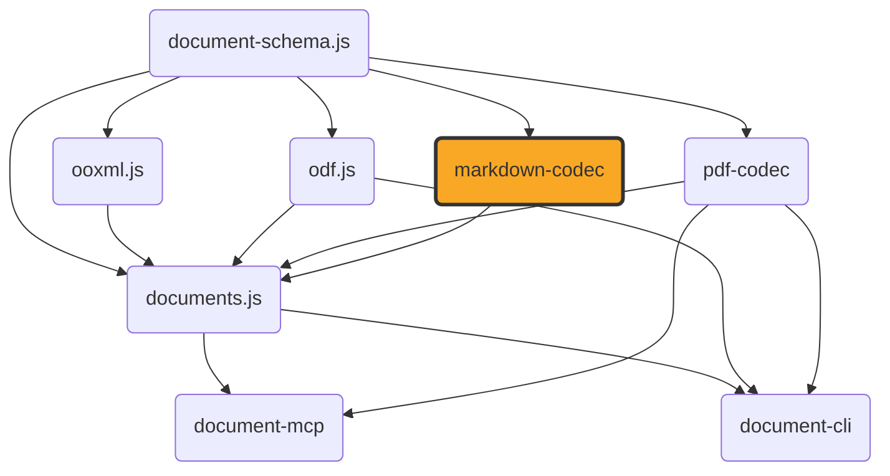

# markdown-codec

[](https://github.com/ExaDev/markdown-codec) [](https://www.npmjs.com/package/markdown-codec) [](https://github.com/ExaDev/markdown-codec/releases/latest) [](https://github.com/ExaDev/markdown-codec/actions)

> Hand-written CommonMark+GFM ⇄ `ContentDocument` codec, built on [document-schema.js](https://github.com/ExaDev/document-schema.js).

`markdown-codec` is a sibling of [`pdf-codec`](https://github.com/ExaDev/pdf-codec): the same "hand-write the format instead of wrapping a third-party library" bet, aimed at CommonMark and its GitHub Flavored Markdown (GFM) extensions rather than PDF. No `micromark`/`remark`/`marked`/`markdown-it`/`commonmark`/`mdast`/`unified`/`turndown`/`showdown` dependency anywhere in this package — see `eslint.config.ts`'s `no-restricted-imports` rule, which bans importing any of them by name, matching this family's own zero-supply-chain-surface ethos: the only runtime dependencies are `document-schema.js` (the shared pivot) and `zod` (schema validation). `readMarkdown`/`writeMarkdown` read and write `document-schema.js`'s shared `ContentDocument` directly, the same pivot [`documents.js`](https://github.com/ExaDev/documents.js) already builds docx/pptx/odt/odp conversions around, so a caller can bridge markdown to any other format that pivot already supports without this package knowing anything about docx, PDF, or ODF.



## Status

The scanner, block parser (`src/block/`), and inline parser (`src/inline/`) are complete hand-written implementations of CommonMark 0.31.2's own two-phase parsing algorithm, plus GFM's table/strikethrough/autolink/task-list-item extensions. `readMarkdown`/`writeMarkdown`/`markdownCodec` (`src/read.ts`/`src/write.ts`/`src/codec.ts`) are wired and real — front matter extraction, block/inline parsing, and lowering to `ContentDocument` compose in one call through `src/lower/lower.ts`'s `lowerMarkdown`; `src/emit/emit.ts`'s `emitMarkdown` is the structural inverse. Tooling (build, lint, typecheck, CI, release) is fully wired.

The conformance suites (`src/conformance.test.ts`, `src/gfm-conformance.test.ts`) measure the real public surface end to end — `readMarkdown` → `writeMarkdown` → reparse → render to HTML — against the vendored CommonMark and GFM spec corpora, and are a materially stricter bar than measuring the bare parser alone: a round trip through `ContentDocument` has to survive `src/lower`'s own semantic mapping *and* `src/emit`'s own inverse rendering with no loss the reparse can detect. See [Fidelity](#fidelity) for what that measures and why the number is lower than 100%: it is dominated by what `ContentDocument` itself can represent, not by parsing gaps.

## Getting started

Requires Node.js `>=20` and pnpm `11.6.0` (pinned via `packageManager` in `package.json`).

```sh
pnpm install
```

Install as a dependency in another project:

```sh
pnpm add markdown-codec
# or
npm install markdown-codec
```

This package is published to [npmjs.org](https://www.npmjs.com/package/markdown-codec) via npm's OIDC trusted publishing — see [Release and publishing](#release-and-publishing) below for the full pipeline. [`documents.js`](https://github.com/ExaDev/documents.js) now consumes it via an ordinary semver range rather than the pinned git commit (`markdown-codec@github:ExaDev/markdown-codec#<commit>`) it depended on before this package's own trusted-publisher setup existed. `dist/` remains committed to the repository rather than gitignored — a holdover from that pre-publish period, when a git-tarball install needed a working build with no install-time compile step: pnpm's own git-dependency preparation sandbox proved unreliable at running a `tsdown` build reliably in CI (two independent, environment-specific failures surfaced while chasing this — a Node.js ESM-loader bug in tsdown's default config loader, then dts generation silently producing zero output under the same sandbox even after routing around the first bug), so shipping the build output directly sidestepped the whole class of problem rather than chasing a third variant of it. Now that a real npm release exists and every known consumer installs from the registry, `dist/` tracking no longer serves that original purpose and is a known cleanup rather than a load-bearing requirement.

## Usage

Reading and writing markdown text:

```ts
import { readMarkdown, writeMarkdown } from 'markdown-codec';

const { document, diagnostics } = readMarkdown('# Title\n\nSome **bold** text with a [link](https://example.com).', {
  frontMatter: true, // parse a leading YAML front matter block into ContentDocument.metadata
  images: (destination) => undefined, // a synchronous MarkdownImageResolver port for non-data: URI images
});

const markdown = writeMarkdown(document, {
  bulletListMarker: '-',
  emphasisMarker: '_',
  frontMatter: true, // emit ContentDocument.metadata back out as a leading front matter block
});
```

Both accept an optional `signal` (`AbortSignal`) and `sink` (a `MarkdownDiagnosticSink`, called once per recoverable read-side issue — a spec-legal-but-almost-certainly-a-typo construct such as an unclosed fence, in addition to a construct either side cannot represent losslessly — see [Gotchas](#gotchas-and-quirks) for the full construct-mapping list, one entry per lowering/emission `MarkdownDiagnosticCodes` code). `writeMarkdown` throws `MarkdownUnsupportedDocumentKindError` for a non-`'wordprocessing'` `ContentDocument` — markdown has no presentation/spreadsheet/drawing equivalent to render.

The same round trip is also available as a schema-validated [`z.codec()`](https://zod.dev) pair, mirroring `pdf-codec`'s own `pdfCodec` convention:

```ts
import { z } from 'zod';
import { markdownCodec, MarkdownBytesSchema } from 'markdown-codec';

const document = z.decode(markdownCodec, bytes); // throws if bytes are not well-formed UTF-8
const bytes2 = z.encode(markdownCodec, document);
```

`MarkdownBytesSchema` checks for well-formed UTF-8 — the one thing genuinely worth validating about arbitrary markdown bytes, since markdown has no magic-byte header of its own and CommonMark's grammar has no "this is not markdown" rejection path (worst case, an unparseable line becomes an ordinary paragraph). This is the no-extra-options form only — `readMarkdown`/`writeMarkdown` remain the entry points wherever a caller needs an `AbortSignal` or a diagnostic sink, since `z.codec()`'s fixed `decode(input)`/`encode(output)` signature has no room for side-channel options.

Every construct-mapping gap either side cannot represent losslessly reports through the sink as a stable, namespaced code (e.g. `md/nested-emphasis-flattened`) — see `MarkdownDiagnosticCodes` (`src/diagnostics/diagnostics.ts`) and [Gotchas](#gotchas-and-quirks) below for the full, named list.

## Architecture

Modelled on `pdf-codec`'s own layering (generic primitives outward to the two conversion directions), aimed at CommonMark+GFM instead of PDF:

- **`src/diagnostics/`** — the read-side diagnostic sink, matching `pdf-codec`'s own three-tier `PdfDiagnosticSink` policy: throw (`MarkdownParseError` and its subclasses — invalid UTF-8, input-too-large, nesting-limit-exceeded) for input this package cannot meaningfully process at all; recover-with-diagnostic for markdown that is spec-legal but almost certainly a typo (an unclosed fence, an unterminated HTML block, a table cell-count mismatch, a duplicate link reference, a list marker-type conflict); degrade-with-diagnostic for an individual construct `src/lower`'s or `src/emit`'s own `ContentDocument` mapping cannot represent, while the rest of the document still reads. `MarkdownDiagnosticCodes` names every code either tier can produce; `src/diagnostics/diagnostics.test.ts` asserts the whole table is reachable from real input.
- **`src/ast/`** — this package's own markdown AST node types (document/block/inline discriminated union), Zod-first like every other model in this family: every node type inferred from its schema, never hand-written.
- **`src/options/`** / **`src/defaults/`** — `readMarkdown`/`writeMarkdown`'s own options (GFM extension toggles, a diagnostic sink, an `AbortSignal`, `writeMarkdown`'s own style choices — heading/bullet/ordered-delimiter/emphasis/code-fence/thematic-break characters, line ending, front matter emission) and their default values.
- **`src/scan/`** — the hand-written CommonMark line/character scanner feeding block parsing, plus `entity-table.ts` (auto-generated by `scripts/generate-entity-table.mjs` from `assets/html-entities/entities.json`, committed to the repository so this package never needs a filesystem read of the vendored asset at runtime).
- **`src/block/`** — CommonMark's block-structure algorithm (open-block stack, continuation-line matching): paragraphs, headings, code blocks, block quotes, lists (including GFM task-list-item markers), thematic breaks, link reference definitions, GFM tables.
- **`src/inline/`** — inline-level parsing within a block's own content: emphasis, code spans, links, autolinks, raw inline HTML, GFM strikethrough, line breaks.
- **`src/html/`** — raw block/inline HTML recognition (CommonMark's own bounded seven-condition block-HTML rules and inline tag syntax — not a general HTML parser) plus `render.ts`, the real CommonMark-HTML conformance oracle `src/conformance.test.ts`/`src/gfm-conformance.test.ts` render parsed documents through — internal plumbing, never re-exported from `src/index.ts`.
- **`src/image/`** — a hand-written PNG/JPEG dimension reader plus an isomorphic base64 codec, shared by `src/lower/image.ts`'s data: URI decoding and `src/emit/image.ts`'s re-encoding.
- **`src/shared/`** — string-shape conventions `src/lower` (mint/read) and `src/emit` (read/write) must agree on exactly: `style-constants.ts` (heading/quote/code-block/rule/HTML-preformatted styleIds, the monospace font family, the blockquote per-level indent unit, the GFM task-checkbox glyph pair) and `list-id.ts` (the opaque `numId` grammar a list's own type/task/tightness is packed into, since `ContentListMembership` itself carries only `{numId, level}`). Most of this module's own surface (`headingStyleId`/`parseHeadingStyleId`/`MAX_HEADING_STYLE_LEVEL`/`QUOTE_STYLE_ID`/`CODE_BLOCK_STYLE_ID`/`HORIZONTAL_RULE_STYLE_ID`/`HTML_PREFORMATTED_STYLE_ID`/`MONOSPACE_FONT_FAMILY`/`QUOTE_INDENT_PT` from `style-constants.ts`, and `createNumIdMintState`/`mintListNumId`/`parseListNumId`/`mintedListType` plus the `ListNumIdInfo`/`ListNumIdMintOptions`/`NumIdMintState` types from `list-id.ts`) is re-exported from `src/index.ts`, not kept internal — so a sibling package building its own editor over a `ContentDocument` (`documents.js`'s `MarkdownEditor`) can mint and parse the identical styleId/numId strings this package's own lower/emit pair uses, rather than duplicating the grammar. `style-constants.ts`'s `TASK_CHECKBOX_UNCHECKED`/`TASK_CHECKBOX_CHECKED` glyphs stay unexported, since a checkbox glyph pair embedded in run text has no identity a caller could round-trip against the way a styleId or numId does.
- **`src/lower/`** — the AST → `ContentDocument` lowering stage: the markdown-side counterpart to `ooxml.js`'s `readDocx`/`readPptx` and `odf.js`'s `readOdt`/`readOdp` — a thin adapter from a format-specific parse result onto the shared pivot, not a second parser. `lower.ts`'s own top-of-file table maps every construct (headings, emphasis/links/breaks via `inline.ts`, code blocks, blockquotes, lists via `src/shared/list-id.ts`, GFM tables via `table.ts`, images via `image.ts`'s `MarkdownImageResolver` port, raw HTML, front matter via `front-matter.ts`) onto its own `MarkdownDiagnosticCodes` gap.
- **`src/emit/`** — the `ContentDocument` → markdown text emission stage (`writeMarkdown`'s build-side half), the structural inverse of `src/lower/` construct for construct — `emit.ts`'s own top-of-file table mirrors `lower.ts`'s.
- **`src/read.ts`** / **`src/write.ts`** / **`src/codec.ts`** — the public `readMarkdown`/`writeMarkdown` entry points and their `z.codec()` pair (`markdownCodec`), matching `pdf-codec`'s own `pdfCodec` convention. `readMarkdown` operates on `document-schema.js`'s full `ContentDocument` envelope directly (`kind`/`formatVersion`/`metadata`/`sections`), not a bare `{metadata, sections}` shape a caller would need to wrap — see `src/read.ts`'s own top-of-file comment for the recorded reconciliation decision, reasoned from `ooxml.js`'s `readXlsxContent`/`buildXlsxPackage` precedent (the more recent design choice in this family, and the structurally closer fit: markdown has no PDF-pivot layout stage of its own, the same position xlsx⇄ods's bridge is in).

## Vendored assets

`assets/` holds real, unmodified conformance corpora fetched directly from their canonical sources, each with its own `NOTICE.md` recording the exact source URL, commit/version, and confirmed licence. None of this is read at runtime by the shipped package — `assets/html-entities/entities.json` is compiled once into `src/scan/entity-table.ts` (a committed, generated source file) by `scripts/generate-entity-table.mjs`, and the two spec corpora are consumed only by the test suite (`src/test-support/spec-corpus.ts`) — so `package.json`'s `"files": ["dist"]` is correct as is; there is nothing under `assets/` a consumer of the published package ever needs.

- **`assets/commonmark/`** — the official CommonMark spec (`spec.txt`) and its machine-readable conformance test corpus (`spec.json`, 652 examples), from the `commonmark/commonmark-spec` project, tag `0.31.2` (CC-BY-SA 4.0).
- **`assets/gfm/`** — the official GitHub Flavored Markdown Spec (`spec.txt`), from `github/cmark-gfm` (CC-BY-SA 4.0).
- **`assets/html-entities/`** — the WHATWG HTML5 named character reference table (`entities.json`), from the WHATWG HTML Standard (BSD 3-Clause, per the WHATWG's own "incorporated into source code" licence clause).

## Build, test, and lint

```sh
pnpm build         # tsdown -> dist/ (ESM + CJS + .d.ts)
pnpm typecheck     # tsc --noEmit
pnpm lint          # eslint . --max-warnings 0
pnpm test          # vitest run --project unit (includes the CommonMark/GFM conformance suites)
pnpm test:watch    # vitest --project unit
pnpm test:coverage # vitest run --project unit --coverage
pnpm test:smoke    # rebuilds dist/, then verifies ESM/CJS export parity and runs a real readMarkdown/writeMarkdown/markdownCodec round trip against each built bundle independently
pnpm test:corpus   # optional, gitignored real-world CommonMark/GFM sanity check -- see Fidelity below
```

To run a single test file: `pnpm vitest run src/path/to/file.test.ts`.

## Conventions

- **Zod-first schema/type/guard**, matching `pdf-codec`/`documents.js`: every model type is inferred from its Zod schema, never hand-written.
- **No type assertions anywhere.** Every loosely-typed value is narrowed through a type guard or a Zod parse at the boundary.
- **No markdown-parsing library dependency**, enforced by an eslint `no-restricted-imports` rule naming every mainstream alternative — this package hand-writes its own scanner, block parser, and inline parser against the CommonMark/GFM specs directly.
- **`z.codec()` for the one schema-to-schema round trip this package owns**, matching `pdf-codec`'s `pdfCodec`/`documents.js`'s `docxPdfCodec` convention: `markdownCodec` wraps the already-independently-tested `readMarkdown`/`writeMarkdown` pair, adding automatic two-way schema validation, deliberately in the no-options form.
- **A shrink-only conformance exclusion list.** Any spec example this package's real read → write → reparse → render pipeline does not yet reproduce byte for byte is named individually in `src/test-support/conformance-exclusions.ts`, with its own test asserting every named example genuinely still fails — the list can shrink as gaps close but can never quietly grow to hide a regression.
- **Conventional commits**, enforced via commitlint + husky, matching the rest of this family.

## Gotchas and quirks

Every construct either `src/lower` (read) or `src/emit` (write) cannot represent losslessly is a documented, reachable `MarkdownDiagnosticCodes` entry, not a silent approximation:

- **`md/invented-page-geometry`** — markdown has no page concept of its own; every lowered document gets one `ContentSection` with A4 + 1in default page geometry (overridable via `ReadMarkdownOptions.pageSize`/`margins`). Fires unconditionally, once per lowered document.
- **`md/nested-emphasis-flattened`** — emphasis nested inside the identical kind (emphasis-in-emphasis, strong-in-strong) flattens to one run rather than preserving the nesting; `src/emit/inline.ts`'s `pickEmphasisMarker` resolves the common single-boundary re-emission case but has no second fallback delimiter character for a genuine three-or-more-way clash between adjacent spans.
- **`md/link-title-dropped`** — a link or image's own title attribute (`[text](url "title")`) has no `ContentRun`/`ContentImageBlock` field to survive on.
- **`md/code-block-info-string-dropped`** — a fenced code block's own info string (the language tag after the opening fence) has no `ContentParagraph` field to survive on.
- **`md/blockquote-nested-depth`** — a blockquote nested beyond one level is recorded only as an indent depth (`indentLeftPt`), never a genuine container boundary; two independent blockquotes back to back at the same depth are indistinguishable from one that spans both.
- **`md/list-item-block-unlisted`** — a table or a resolved image directly inside a list item has no way to carry `ContentListMembership`, which lives only on `ContentParagraph`.
- **`md/list-item-multi-block-flattened`** — a list item containing more than one non-nested-list block loses its own item-boundary identity once lowered; `ContentListMembership` carries only `{numId, level}`, with no field distinguishing "one item, several blocks" from "several items sharing this numId/level".
- **`md/image-unresolved`** — an image with no `MarkdownImageResolver` supplied (or one that returns `undefined`, or resolved bytes that are neither a readable PNG nor JPEG) degrades to a hyperlinked text run of its own alt text, never an invalid `ContentImageBlock`.
- **`md/raw-html-preserved-as-text` / `md/raw-html-dropped`** — raw HTML is preserved as literal text by default (styleId `HTMLPreformatted` for block-level HTML) or dropped entirely (`rawHtml: 'drop'`); this package's read side never sanitises or interprets it.
- **`md/front-matter-key-unmapped`** — a leading YAML front matter block is not parsed by a real YAML/TOML engine; only `key: value` lines (plus one array special case for `keywords`) mapping onto five known `LayoutMetadata` fields are recognised, everything else is reported and dropped.
- **`md/heading-level-clamped`** — a `ContentDocument` heading styleId beyond `Heading6` (never produced by this package's own read side, but reachable from another format's `ContentDocument` via the shared pivot) clamps to level 6, since neither ATX nor setext syntax spells a deeper level.
- **`md/adjacent-links-merged`** and **`md/code-span-as-monospace-run`** — a run of adjacent hyperlinks sharing one destination merges into a single markdown link; a monospace-font run without a genuine code-span origin still emits as a code span, since `ContentDocument` has no separate "this was actually a code span" marker.
- **`md/paragraph-indent-dropped`** — a paragraph carrying `indentLeftPt` with none of the five styleIds this package's own blockquote/code-block/rule/HTML-preformatted convention recognises is a genuine cross-format ambiguity (is it a quote, or another format's own paragraph indentation?) this package cannot resolve; the indent is dropped, the paragraph still renders.
- **`md/list-numid-fallback`** — a `numId` this package never minted itself (another format's own list-identity scheme) falls back to a plain, tight, non-task bullet list, the documented cross-format contract for `src/shared/list-id.ts`'s opaque grammar.
- **`md/table-cell-formatting-dropped`** and **`md/table-cell-multi-paragraph-joined`** — a GFM table cell's own run-level formatting beyond plain text, and a cell containing more than one paragraph, are both lossy: GFM's own table-cell grammar has no multi-paragraph or rich-formatting representation to write back to.

## Fidelity

**Markdown → `ContentDocument` is dominated by target-schema limits, not parsing gaps — the inverse framing from `pdf-codec`'s own Fidelity section, where the *source* format (arbitrary real-world PDF) is what bounds fidelity.** Here, the hand-written parser understands everything CommonMark and GFM define — every construct in both specifications is recognised and structurally parsed correctly. What `ContentDocument` cannot hold is the limiting factor: it is a cross-format pivot shared with docx/pptx/odt/odp/ods/odg, shaped around what THOSE formats can represent, not around markdown's own richer container/precision model (no blockquote container node, no fenced-code-fence-character-choice field, no per-list-item multi-block boundary, no link/image title). Every one of these is a genuine, permanent structural mismatch between markdown's own grammar and the shared pivot's shape, not something a better parser could close.

**The real, reported round-trip conformance rate** — measured by `src/conformance.test.ts`/`src/gfm-conformance.test.ts` running the actual public surface (`readMarkdown` → `writeMarkdown` → reparse → render to HTML) against the vendored spec corpora, compared byte for byte against each example's own expected HTML — is:

| Corpus | Examples | Passing round trip | Rate |
| --- | --- | --- | --- |
| CommonMark 0.31.2 (`assets/commonmark/spec.json`) | 652 | 461 | 70.7% |
| GFM tagged extensions (table/strikethrough/autolink/task-list, `assets/gfm/spec.txt`) | 23 | 22 | 95.7% |
| Combined | 675 | 483 | 71.6% |

Every one of the 192 examples not yet passing is named individually in `src/test-support/conformance-exclusions.ts`, attributed to one of a small, closed set of named, understood causes (a shrink-only list — see [Conventions](#conventions)): most commonly a soft line break collapsing to a literal space rather than surviving as a literal newline (the single largest reason by count), a dropped link/image title or code-fence info string, a flattened multi-block list item or nested blockquote, or several directly-touching emphasis spans that only leave two delimiter characters to resolve every boundary at once. None of these are "not yet gotten around to" placeholders — each is an architectural limitation of `ContentDocument`'s own shape, re-diagnosed and found reachable through many corpus examples at once, which is why `conformance-exclusions.ts`'s own reason strings are shared, named constants rather than one bespoke sentence per example.

This is also why `pdf-codec`'s own permanent "no round-trip-losslessness claim" framing applies here for the identical underlying reason but the opposite direction of blame: `pdf-codec` cannot promise fidelity because arbitrary real-world PDF vastly exceeds what any parser can safely assume about it; `markdown-codec`'s parser is complete, but `ContentDocument` itself is the narrower vessel a full CommonMark+GFM document is being poured into.

**Optional real-world corpus.** `test/corpus/` (gitignored, never committed) holds a `pnpm test:corpus` vitest project for a manual sanity check against real, large, table-heavy, fence-heavy markdown a hand-built fixture can't fully stand in for — this family's own sibling repository READMEs (`documents.js`, `pdf-codec`, `odf.js`, `ooxml.js`, `document-schema.js`), read straight from their checkout locations on disk. It asserts only that `readMarkdown`/`writeMarkdown` don't throw and that a reparse still produces real content — not byte-for-byte fidelity, which real-world markdown was never going to hold to anyway. It is not part of `pnpm test` and never gates CI; run it locally before a significant change to `src/lower/`, `src/emit/`, or the scanner/block/inline layers.

## Release and publishing

`.github/workflows/ci.yml` runs commitlint, lint, typecheck, the unit suite (including the conformance suites), and the smoke test on every push and pull request. On a push to `main` where those all pass, `release.config.ts` drives [semantic-release](https://semantic-release.gitbook.io/semantic-release): commit history since the last tag decides the version bump, `CHANGELOG.md` and `package.json` are committed back to `main`, a GitHub Release is cut, and the package publishes to [npmjs.org](https://www.npmjs.com/package/markdown-codec) via npm's OIDC trusted publishing, so no `NPM_TOKEN` exists anywhere in the pipeline.

Whether that release actually published a new version is detected by diffing `package.json`'s version before and after the release step, not by trusting a third-party action's own detection. Four further jobs gate on that: one dispatches a `sibling-released` `repository_dispatch` event to `documents.js`, so that repo's own dependency-bump PR opens within seconds rather than waiting on Dependabot's next daily scan; one republishes the same build under the scoped `@exadev/markdown-codec` alias to GitHub Packages (which has no OIDC exchange of its own, so it authenticates with `GITHUB_TOKEN` instead); one republishes under the `mrkdwn.js` alias to npmjs.org via the identical OIDC exchange; and one packs the release into its own directory, generates an SPDX SBOM (`pnpm sbom`), and signs both an SBOM and a build-provenance attestation against that exact tarball — verifiable independently of the registry, and still present if the package is later unpublished.

## Contributing

Commits follow Conventional Commits (`feat:`, `fix:`, `test:`, `chore:`, …), enforced by commitlint (`commitlint.config.ts`) via a husky `commit-msg` hook and a CI `commitlint` job — semantic-release's version bump depends on these being well-formed, not just style. A husky `pre-commit` hook runs `lint-staged` (`eslint --fix` on staged `*.ts` files) and `pre-push` runs the test suite. There is a single `main` branch and no open pull request workflow established so far.

## References

- [document-schema.js](https://github.com/ExaDev/document-schema.js) — the sibling package that owns the shared `ContentDocument` pivot this package reads and writes.
- [pdf-codec](https://github.com/ExaDev/pdf-codec) — the sibling package this project's own scaffold, tooling, and "hand-write the format" philosophy are modelled on.
- [documents.js](https://github.com/ExaDev/documents.js) — the consumer package that bridges markdown to docx/odt/PDF via this package's `ContentDocument` output: `markdownToPdf`/`pdfToMarkdown` through the shared wordprocessing layout engine docx/odt already use, and `markdownToDocx`/`docxToMarkdown`, `markdownToOdt`/`odtToMarkdown` as direct `ContentDocument`-to-`ContentDocument` bridges bypassing the PDF pivot entirely, the same way it already bridges odt⇄docx and odp⇄pptx. Markdown has no presentation/spreadsheet/drawing `ContentDocument` variant of its own, so pptx/odp/ods/odg are out of reach structurally, not merely unimplemented.
- [CommonMark Spec](https://spec.commonmark.org/) — the base specification this package's scanner/block/inline parsers target.
- [GitHub Flavored Markdown Spec](https://github.github.com/gfm/) — the GFM extensions layered on top of CommonMark.
- [WHATWG HTML Standard § named character references](https://html.spec.whatwg.org/multipage/named-characters.html) — the entity table `assets/html-entities/` vendors.

## npm aliases

This package also publishes under the following alternate npm name — the identical build, same version, republished by CI alongside the primary `markdown-codec` package:

- [mrkdwn.js](https://www.npmjs.com/package/mrkdwn.js)

## License

MIT
